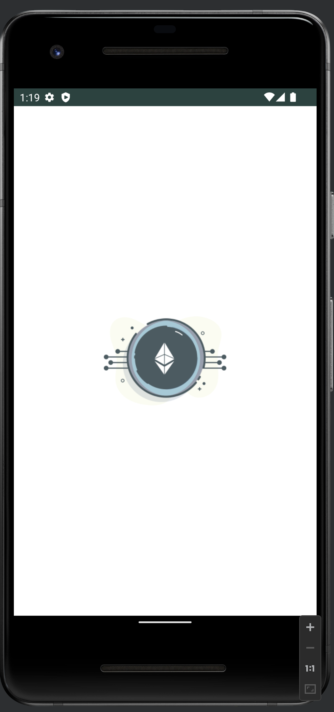
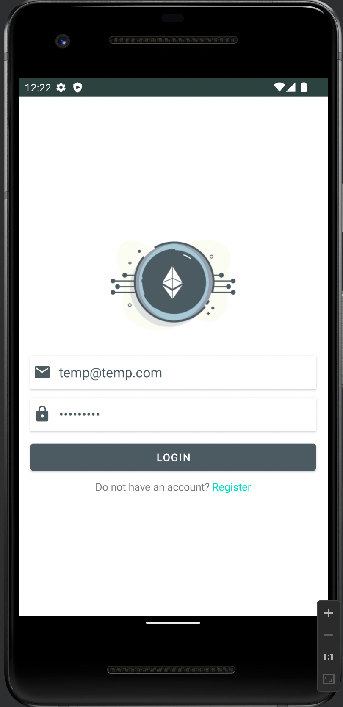
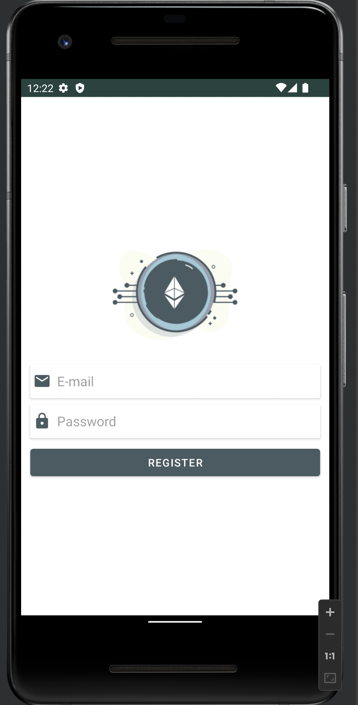
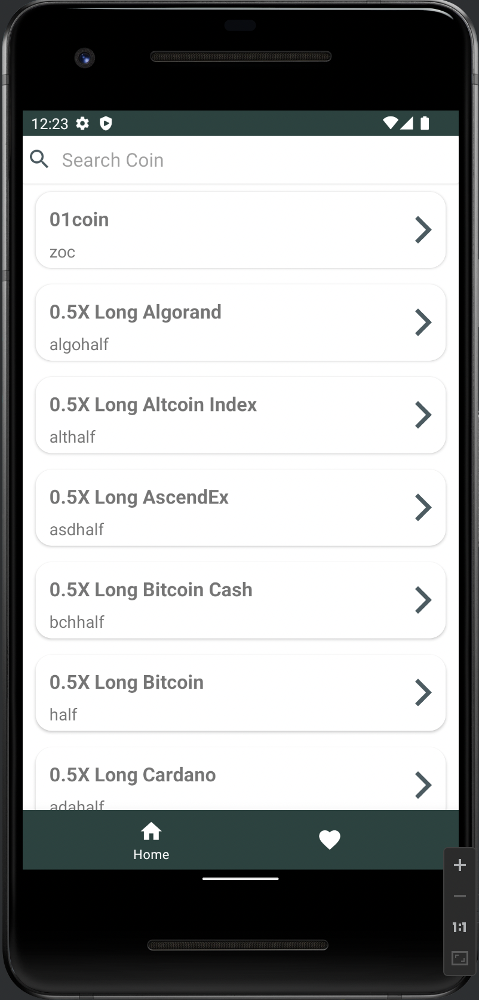
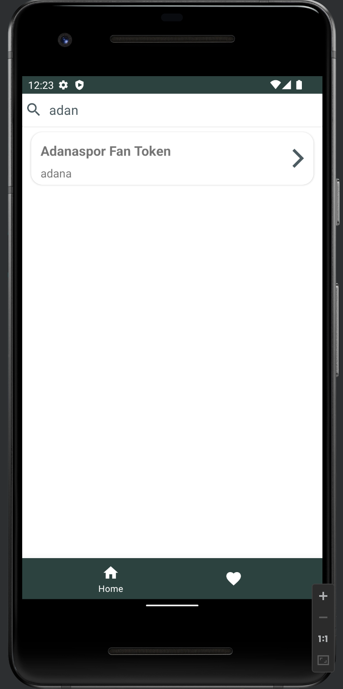
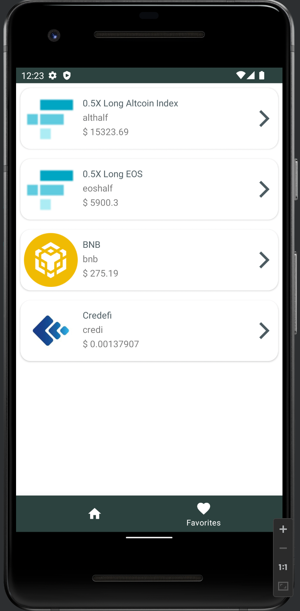

# Bitcoin-Ticker 

## 📦 Modules

Modules are the collection of source files and build settings that allow you to divide your project into discrete units of functionality.

- **Data Module**

  `:data` module contains models, api services, local database and repository classes
  
- **DI Module**

  `:di` module contains dependency injection modules

- **Domain Module**

  `:domain` module contains use case classes and repository classes
  
- **Presentation Module**

  `:presentation` module contains fragment and view model classes

# System Requirements

- Android Studio
- Clean Architecture
- MVVM
- Flow
- Navigation Component
- Dagger/Hilt
- Coil
- Firebase Authentication(Email - password)
- Firestore

# Features

- Login and Register Page: You can register and login app email and password thanks to Firebase Authentication. 
- Get Coin List. In lists page, you can find coin search, name, symbol name. In addition in the Coin List, you can check coins's overview. When you click coin in the lists page, you redirected Coin Detail Page.
- Coin Detail Page by: coin image, name, symbol, hashing algorithm, price and price change percentage.
- Favorites Page: When user click add favorites button in coin detail page. The coin added favorites list and show in this page. Favorites information stored in Firestore.
- Search Features developed by Room Database. We get API datas and insert Room Database and search in this database. 

# Screenshots

